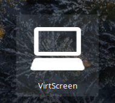

# VirtScreen

> Make your iPad/tablet/computer as a secondary monitor on Linux.


VirtScreen is an easy-to-use Linux GUI app that creates a virtual secondary screen and shares it through VNC.

VirtScreen is based on [PyQt5](https://www.riverbankcomputing.com/software/pyqt/intro) and [Twisted](https://twistedmatrix.com) in Python side and uses [x11vnc](https://github.com/LibVNC/x11vnc) and XRandR.

## How to use

Upon installation (see Installing section to install), there will be a desktop entry called `virtscreen`



Or you can run it using a command line:

```bash
$ virtscreen
```

Note that any files related to VirtScreen, including password and log, will be stored in `~/.virtscreen` directory.

## Dependancies

You need [`x11vnc`](https://github.com/LibVNC/x11vnc) and `xrandr`. To install (example on Ubuntu):
```bash
$ sudo apt-get install x11vnc
```

## Installing

### Debian (Ubuntu)

A PPA package will be available soon.

### Arch Linux (AUR)

There is [`virtscreen` AUR package](https://aur.archlinux.org/packages/virtscreen/) available. Though there are many ways to install the AUR package, one of the easiest way is to use [`aurman`](https://github.com/polygamma/aurman) AUR helper:

```bash
$ aurman -S virtscreen
```

### Python `pip`

If your distro is none of above, you may install it using `pip`:

```bash
$ pip install virtscreen
```

but a desktop entry won't be created.

### From the Git repository directly

```bash
$ python setup.py install # add --user option if you have permission problem
```
